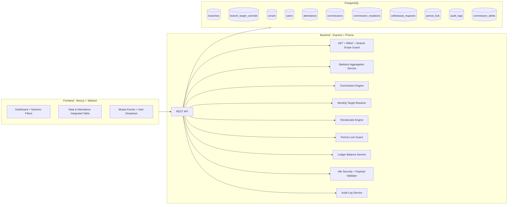

# KomCS PJB — Correction, Hardening, Statistics & Dynamic Target Update

## 1) Arsitektur Sistem (Updated)



### Prinsip Utama
- **Ledger-first balance:** saldo selalu dihitung dari arus mutasi (`SUM(masuk)-SUM(keluar)`).
- **Dynamic monthly target:** target min/max bisa override per cabang per bulan.
- **Filter reactive + dependent dropdown:** cabang mempengaruhi daftar user.
- **Transaction-safe finance:** recalculation dan withdrawal approval selalu dalam transaksi + row lock.

---

## 2) DDL SQL (Updated)

File: `database/schema.sql`.

Tambahan penting revisi ini:
- Tabel baru `branch_target_override`.
- Index optimasi statistik all-time/global.
- Constraint untuk validasi override target bulanan.

---

## 3) Target Dinamis (Default vs Override)

### Aturan
1. Ambil target default dari `branches.target_min/target_max`.
2. Cek `branch_target_override` berdasarkan `(branch_id, month, year)`.
3. Jika ada override, pakai override untuk seluruh tanggal pada bulan tersebut.
4. Jika tidak ada override, fallback ke target default cabang.

### SQL Resolver (contoh)
```sql
SELECT
  b.id AS branch_id,
  COALESCE(o.target_min, b.target_min) AS target_min_effective,
  COALESCE(o.target_max, b.target_max) AS target_max_effective
FROM branches b
LEFT JOIN branch_target_override o
  ON o.branch_id = b.id
 AND o.month = $1
 AND o.year = $2
WHERE b.id = $3;
```

---

## 4) Statistik Komisi & Omzet dengan Advanced Filter

### Filter Waktu
- Bulan ini
- Bulan lalu
- Bulan + tahun tertentu
- Semua bulan dalam 1 tahun
- All-time

### Filter Scope
- Global (semua cabang + semua user)
- Per cabang - all user
- Per cabang - per user

### Output Statistik
- Total omzet
- Total komisi global
- Total komisi per user
- Grafik omzet bulanan (1 tahun)
- Grafik komisi per user (1 tahun)

### Flow Filter Logic
```text
frontend_filter_change -> build query params -> call /stats endpoints
-> backend validate scope by role
-> translate preset into date range
-> run aggregate queries
-> return summary + chart datasets
-> UI rerender without full page reload
```

### Contoh Query Agregasi (Global/Branch/User)
```sql
-- summary omzet + komisi
SELECT
  COALESCE(SUM(o.total),0) AS total_omzet,
  COALESCE(SUM(c.nominal),0) AS total_komisi
FROM omzet o
LEFT JOIN commissions c
  ON c.omzet_id = o.id
WHERE o.tanggal BETWEEN $1 AND $2
  AND ($3::BIGINT IS NULL OR o.branch_id = $3)
  AND ($4::BIGINT IS NULL OR c.user_id = $4);
```

```sql
-- chart omzet bulanan per tahun
SELECT
  EXTRACT(MONTH FROM o.tanggal)::INT AS bulan,
  COALESCE(SUM(o.total),0) AS omzet
FROM omzet o
WHERE EXTRACT(YEAR FROM o.tanggal) = $1
  AND ($2::BIGINT IS NULL OR o.branch_id = $2)
GROUP BY EXTRACT(MONTH FROM o.tanggal)
ORDER BY bulan;
```

```sql
-- chart komisi user per bulan per tahun
SELECT
  c.user_id,
  EXTRACT(MONTH FROM c.tanggal)::INT AS bulan,
  COALESCE(SUM(c.nominal),0) AS komisi
FROM commissions c
JOIN users u ON u.id = c.user_id
WHERE EXTRACT(YEAR FROM c.tanggal) = $1
  AND ($2::BIGINT IS NULL OR u.branch_id = $2)
  AND ($3::BIGINT IS NULL OR c.user_id = $3)
GROUP BY c.user_id, EXTRACT(MONTH FROM c.tanggal)
ORDER BY c.user_id, bulan;
```

---

## 5) Tampilan Bulanan Lengkap (Rule Rentang Tanggal)

### Bulan Berjalan
- Tampilkan tanggal 1 sampai **tanggal terakhir yang sudah ada input omzet**.
- Tidak memaksa 30/31 jika data belum ada.

### Bulan Sebelumnya
- Tampilkan full 1 bulan (1..30/31).

### Utility Logic
```text
if selected_month == current_month && selected_year == current_year:
  max_day = MAX(omzet.tanggal within month + scope)
  range = [1..day(max_day)]
else:
  range = [1..last_day_of_month]
```

---

## 6) Data & Kehadiran dalam 1 Halaman Terintegrasi

Kolom tabel per cabang:
- Tanggal
- Cash
- Piutang
- Total Omzet
- Target Min (effective)
- Target Max (effective)
- Status Target (Tercapai Min / Tercapai Max / Tidak)
- Kehadiran CS 1
- Kehadiran CS 2
- Komisi CS 1
- Komisi CS 2
- Status Komisi (DRAFT / FINAL / LOCKED)

### Query basis tabel terintegrasi (contoh)
```sql
SELECT
  o.tanggal,
  o.cash,
  o.piutang,
  o.total,
  COALESCE(bto.target_min, b.target_min) AS target_min_effective,
  COALESCE(bto.target_max, b.target_max) AS target_max_effective,
  CASE
    WHEN o.total >= COALESCE(bto.target_max, b.target_max) THEN 'TERCAPAI_MAX'
    WHEN o.total >= COALESCE(bto.target_min, b.target_min) THEN 'TERCAPAI_MIN'
    ELSE 'TIDAK'
  END AS status_target
FROM omzet o
JOIN branches b ON b.id = o.branch_id
LEFT JOIN branch_target_override bto
  ON bto.branch_id = o.branch_id
 AND bto.month = EXTRACT(MONTH FROM o.tanggal)
 AND bto.year = EXTRACT(YEAR FROM o.tanggal)
WHERE o.branch_id = $1
  AND o.tanggal BETWEEN $2 AND $3
ORDER BY o.tanggal;
```

---

## 7) Mutasi Komisi – Dropdown Per User

### Filter
- Admin: Cabang (termasuk Global), User, Bulan, Tahun.
- HRD: User dalam cabang sendiri, Bulan, Tahun.
- CS: hanya user sendiri.

### Output
- Arus masuk (auto dari komisi)
- Arus keluar (manual/withdrawal)
- Saldo real-time dari ledger

### Ledger Query (saldo real-time)
```sql
SELECT COALESCE(SUM(
  CASE WHEN tipe='masuk' THEN nominal ELSE -nominal END
), 0) AS saldo_real_time
FROM commission_mutations
WHERE user_id = $1;
```

### Summary mode Admin Global
```sql
SELECT
  COALESCE(SUM(CASE WHEN tipe='masuk' THEN nominal ELSE 0 END),0) AS total_masuk,
  COALESCE(SUM(CASE WHEN tipe='keluar' THEN nominal ELSE 0 END),0) AS total_keluar,
  COALESCE(SUM(CASE WHEN tipe='masuk' THEN nominal ELSE -nominal END),0) AS total_saldo
FROM commission_mutations
WHERE tanggal BETWEEN $1 AND $2;
```

---

## 8) Recalculation Transaction-safe (Tetap Berlaku)

Saat attendance diubah:
1. tampilkan warning konfirmasi user,
2. `BEGIN`,
3. update attendance,
4. delete commissions auto hari itu,
5. delete mutation auto masuk hari itu,
6. hitung ulang berdasarkan omzet + attendance + effective target,
7. insert ulang commission (`DRAFT`) dan mutation masuk,
8. tulis `audit_logs`,
9. `COMMIT` / rollback penuh jika gagal.

---

## 9) API Endpoint Tambahan (Dynamic Statistics + Target Override)

- `GET /api/v1/stats/summary?scope=global|branch|user&branchId=&userId=&preset=this_month|last_month|year|all_time&month=&year=`
- `GET /api/v1/stats/chart/omzet-monthly?year=&branchId=`
- `GET /api/v1/stats/chart/commission-user?year=&branchId=&userId=`
- `GET /api/v1/data-attendance?branchId=&month=&year=&userId=`
- `GET /api/v1/mutations?branchId=&userId=&month=&year=&mode=summary|detail`
- `POST /api/v1/branch-target-override`
- `PATCH /api/v1/branch-target-override/:id`
- `DELETE /api/v1/branch-target-override/:id`

---

## 10) Wireframe Update

### Dashboard (Admin)
```text
+--------------------------------------------------------------------------------+
| Filter Bar: [Preset Waktu] [Bulan] [Tahun] [Cabang] [User] [Apply]            |
+--------------------------------------------------------------------------------+
| Card: Total Omzet | Card: Total Komisi Global | Card: Total Saldo Ledger       |
+--------------------------------------------------------------------------------+
| Chart Omzet Bulanan (1 Tahun)              | Chart Komisi per User (1 Tahun)   |
+--------------------------------------------------------------------------------+
| Table Summary User (Omzet/Komisi/Saldo)                                      |
+--------------------------------------------------------------------------------+
```

### Data & Kehadiran (Integrated)
```text
+--------------------------------------------------------------------------------------------------+
| Filter: [Cabang] [Bulan] [Tahun] [User(optional)]                                                |
+--------------------------------------------------------------------------------------------------+
| Tanggal | Cash | Piutang | Total | TargetMin | TargetMax | StatusTarget | AttCS1 | AttCS2 | ... |
| ... Komisi CS1 | Komisi CS2 | Status Komisi (DRAFT/FINAL/LOCKED)                                |
+--------------------------------------------------------------------------------------------------+
```

### Mutasi Komisi
```text
+--------------------------------------------------------------------------------+
| Filter: [Cabang/Admin] -> [User Dropdown dependent] [Bulan] [Tahun] [Mode]    |
+--------------------------------------------------------------------------------+
| Ringkasan: Total Masuk | Total Keluar | Saldo Real-time                        |
+--------------------------------------------------------------------------------+
| Tabel Mutasi (tanggal, tipe, nominal, saldo_after, keterangan)                |
+--------------------------------------------------------------------------------+
```

---

## 11) UX Modern Validation

- Filter **reactive** (no full reload).
- Dropdown dependent: pilih cabang -> fetch user cabang.
- Currency format IDR otomatis (`Intl.NumberFormat('id-ID',{style:'currency',currency:'IDR'})`).
- Loading state (skeleton/spinner).
- Empty state untuk data kosong.

---

## 12) Performance Notes

- Gunakan index pada query statistik dan mutasi multi-bulan.
- Batasi payload chart dengan agregasi di SQL (bukan di frontend).
- Gunakan pagination untuk tabel detail mutasi.
- Pertahankan audit log untuk setiap perubahan kritikal (target override, recalculation, approval).

---

## 13) Mobile-First Responsive Layout Strategy

### Breakpoint Policy
- **Mobile:** `< 640px`
- **Tablet:** `640px - 1024px`
- **Desktop:** `> 1024px`

### Dashboard Behavior (HP)
- Statistik card wajib **1 kolom** (stack vertikal).
- Spasi antar card minimal `12-16px`.
- Grafik full width, tinggi adaptif (`min-h-[240px]`).
- Font body minimal `14px`.
- Highlight angka besar komisi/omzet tampil center aligned.

### Filter Layout (Mobile)
Urutan vertikal:
1. Filter Cabang
2. Filter User (dependent)
3. Filter Bulan
4. Filter Tahun
5. Tombol `🔍 Terapkan Filter`

### Data & Attendance on Mobile
Strategi default: **Table-to-Card transformation** per tanggal (lebih readable daripada horizontal scroll panjang).

---

## 14) Wireframe Mobile View (Updated)

### Mobile Dashboard (CS/Admin/HRD)
```text
+-----------------------------------------+
| Header: KomCS PJB       [☾ Dark Toggle] |
+-----------------------------------------+
| Filter Cabang                            |
| Filter User                              |
| Filter Bulan                             |
| Filter Tahun                             |
| [🔍 Terapkan Filter]                     |
+-----------------------------------------+
| Komisi Hari Ini                          |
| Rp 1.250.000                             |
+-----------------------------------------+
| Sisa Komisi                              |
| Rp 8.540.000                             |
+-----------------------------------------+
| Total Omzet                              |
| Rp 55.000.000                            |
+-----------------------------------------+
| [Chart Omzet Bulanan - Full Width]       |
+-----------------------------------------+
| [Chart Komisi User - Full Width]         |
+-----------------------------------------+
```

### Mobile Data & Kehadiran (Card per Tanggal)
```text
+-----------------------------------------+
| 01-01-2026                               |
| Cash: Rp 35.000.000                      |
| Piutang: Rp 20.000.000                   |
| Total: Rp 55.000.000                     |
| Target: 🟢 Tercapai Max                  |
| CS1: Hadir - Rp X                        |
| CS2: Hadir - Rp Y                        |
| Komisi: 🟡 Draft                          |
+-----------------------------------------+
```

---

## 15) Color System Definition

### Palette
- **Primary:** `#1E3A8A`
- **Secondary:** `#2563EB`
- **Success:** `#16A34A`
- **Warning:** `#F59E0B`
- **Danger:** `#DC2626`
- **Background:** `#F8FAFC`
- **Card:** `#FFFFFF`
- **Text Primary:** `#111827`
- **Text Secondary:** `#6B7280`

### Dark Mode (Optional)
- **Background:** `#0F172A`
- **Card:** `#1E293B`
- **Text:** `#F1F5F9`

### Rule
- Hindari warna neon.
- Pastikan contrast ratio tinggi untuk outdoor readability.
- Gunakan warna status secara konsisten pada badge, icon, dan border state.

---

## 16) Typography Guideline

- Font family: **Inter** (default), fallback `Poppins`, `Roboto`, `sans-serif`.
- **Title:** `18-22px`
- **Subtitle:** `16px`
- **Body:** minimal `14px`
- **Big Number (komisi/omzet):** `20-24px`, weight `600`
- Highlight gunakan weight `500-600`, hindari over-bold.

---

## 17) UI Component Guideline (Button, Badge, Empty, Loading)

### Button System
- Tinggi minimal: `40px`
- Radius: `rounded-lg`
- Touch-friendly padding horizontal `px-4` atau lebih

**Primary**
- bg `#2563EB`, text putih, hover gelap (`#1E3A8A`)

**Secondary**
- border biru, text biru, bg putih

**Danger**
- bg `#DC2626`, text putih

### Badge System
- Rounded full, padding kecil (`px-2.5 py-1`)
- Status Target:
  - `🟢 Tercapai Max`
  - `🟡 Tercapai Min`
  - `🔴 Tidak Tercapai`
- Status Komisi:
  - `🟢 Final`
  - `🟡 Draft`
  - `🔒 Locked`
- Status Withdrawal:
  - `🟡 Pending`
  - `🟢 Approved`
  - `🔴 Rejected`

### Loading & Empty States
- Loading: skeleton cards + skeleton table/card rows.
- Empty state: icon + teks kontekstual + CTA refresh/filter reset.

### Confirmation Modal (Wajib)
Dipakai untuk aksi berisiko:
- Recalculate komisi
- Ubah kehadiran
- Approve withdrawal

---

## 18) Tailwind Class Structure (Example)

```tsx
// Mobile-first filter panel
<div className="grid grid-cols-1 gap-3 sm:grid-cols-2 lg:grid-cols-4">
  <Select className="h-10 text-sm" />
  <Select className="h-10 text-sm" />
  <Select className="h-10 text-sm" />
  <Select className="h-10 text-sm" />
  <button className="h-10 rounded-lg bg-blue-600 px-4 text-white hover:bg-blue-800 active:scale-[0.99]">
    🔍 Terapkan Filter
  </button>
</div>

// KPI card
<section className="rounded-xl bg-white p-4 shadow-sm ring-1 ring-slate-200">
  <p className="text-sm text-slate-500">Komisi Hari Ini</p>
  <h2 className="mt-1 text-center text-2xl font-semibold text-slate-900">Rp 1.250.000</h2>
</section>

// Responsive chart wrapper
<div className="w-full rounded-xl bg-white p-3 sm:p-4">
  <div className="h-[240px] sm:h-[300px] lg:h-[360px]">{/* chart */}</div>
</div>
```

---

## 19) Table-to-Card Transformation Logic (Mobile)

```text
if viewport < 640px:
  render card-list per tanggal
else:
  render data table (sticky header optional)

Card data source:
- tanggal
- cash/piutang/total
- target min/max + status
- attendance CS1/CS2
- komisi CS1/CS2
- status komisi
```

Fallback alternatif jika table tetap dipakai di HP:
- `overflow-x-auto`
- sticky header
- sticky kolom tanggal

---

## 20) Frontend API/State UX Flow (Reactive)

```text
onFilterChange:
  update local filter state
  debounce 250ms (optional)
  fetch summary + charts + table/cards in parallel
  show skeleton while pending
  show empty state if no rows
  persist filter to querystring for shareable URL
```

---

## 21) Accessibility & Comfort Notes

- Tap target minimum `40x40`.
- Hindari paragraf panjang pada mobile; gunakan chunk informasi.
- Gunakan line-height longgar (`leading-6`) untuk body text.
- Status warna selalu ditemani label teks/icon (jangan warna saja).
- Pastikan tidak perlu zoom untuk membaca angka utama.

---

## 22) Dark Mode Contrast & Accessibility Upgrade (WCAG AA)

### Layered Dark Surfaces (Wajib)
Gunakan layering agar depth terbaca dan tidak melelahkan mata:
- **Base Background:** `#0F172A` (Slate 900)
- **Secondary Surface (Card/Table Header):** `#1E293B` (Slate 800)
- **Elevated Surface (Modal/Dropdown):** `#334155` (Slate 700)

> Hindari `#000000` murni agar tidak terlalu keras di mata.

### Dark Text Tokens (High Contrast)
- **Text Primary:** `#F8FAFC` (judul, angka komisi, angka omzet, label penting)
- **Text Secondary:** `#CBD5E1` (deskripsi, metadata)
- **Text Muted:** `#94A3B8` (hint, placeholder)

> Di dark mode jangan pakai `#6B7280` untuk body text karena terlalu redup.

### Status Color (Bright-on-Dark)
- **Success:** text `#22C55E`, bg `rgba(34,197,94,0.15)`
- **Warning:** text `#FACC15`, bg `rgba(250,204,21,0.15)`
- **Danger:** text `#F87171`, bg `rgba(248,113,113,0.15)`
- **Info:** text `#38BDF8`, bg `rgba(56,189,248,0.15)`

### Button Contrast (Dark Theme)
- **Primary:** bg `#2563EB`, text `#FFFFFF`, hover `#1D4ED8`
- **Danger:** bg `#DC2626`, text `#FFFFFF`, hover `#B91C1C`
- **Secondary:** bg `#334155`, border `#475569`, text `#F8FAFC`

### Input/Form Contrast
- Input bg `#1E293B`
- Border `#475569`
- Focus border `#3B82F6`
- Focus ring/shadow `0 0 0 2px rgba(59,130,246,0.4)`
- Placeholder `#94A3B8`
- Input text `#F8FAFC`

### Table Dark Version
- Header: bg `#1E293B`, text `#F8FAFC`
- Row: bg `#0F172A`
- Row hover: `#1E293B`
- Border: `#334155`

### Angka Komisi/Omzet (Critical Readability)
- Gunakan warna `#FFFFFF`
- Font-weight `600-700`
- Jangan gunakan grey untuk angka utama di dashboard/card.

---

## 23) Dark Theme Tokens & Tailwind Config Example

```ts
// tailwind.config.ts (example)
export default {
  darkMode: 'class',
  theme: {
    extend: {
      colors: {
        dark: {
          base: '#0F172A',
          surface: '#1E293B',
          elevated: '#334155',
          text: '#F8FAFC',
          textSecondary: '#CBD5E1',
          textMuted: '#94A3B8',
          border: '#334155',
          borderStrong: '#475569',
          success: '#22C55E',
          warning: '#FACC15',
          danger: '#F87171',
          info: '#38BDF8',
        },
      },
      boxShadow: {
        'focus-dark': '0 0 0 2px rgba(59,130,246,0.4)',
      },
    },
  },
};
```

```tsx
// Example usage
<div className="bg-slate-50 text-slate-900 dark:bg-dark-base dark:text-dark-text">
  <div className="rounded-xl bg-white ring-1 ring-slate-200 dark:bg-dark-surface dark:ring-dark-border">
    <h2 className="text-2xl font-semibold text-slate-900 dark:text-white">Rp 8.540.000</h2>
    <p className="text-sm text-slate-500 dark:text-dark-textSecondary">Sisa Komisi</p>
  </div>
</div>
```

---

## 24) Button & Badge Component Update (Dark-aware)

### Button Class Pattern
```tsx
const btnPrimary =
  "h-10 rounded-lg bg-blue-600 px-4 text-white hover:bg-blue-700 active:scale-[0.99] dark:bg-[#2563EB] dark:hover:bg-[#1D4ED8]";

const btnDanger =
  "h-10 rounded-lg bg-red-600 px-4 text-white hover:bg-red-700 dark:bg-[#DC2626] dark:hover:bg-[#B91C1C]";

const btnSecondary =
  "h-10 rounded-lg border border-blue-600 px-4 text-blue-600 hover:bg-blue-50 dark:border-[#475569] dark:bg-[#334155] dark:text-[#F8FAFC]";
```

### Badge Class Pattern
```tsx
const badgeSuccess = "rounded-full px-2.5 py-1 text-xs font-medium text-green-500 bg-[rgba(34,197,94,0.15)]";
const badgeWarning = "rounded-full px-2.5 py-1 text-xs font-medium text-yellow-300 bg-[rgba(250,204,21,0.15)]";
const badgeDanger = "rounded-full px-2.5 py-1 text-xs font-medium text-red-400 bg-[rgba(248,113,113,0.15)]";
const badgeInfo = "rounded-full px-2.5 py-1 text-xs font-medium text-sky-400 bg-[rgba(56,189,248,0.15)]";
```

---

## 25) Table, Dropdown, Modal Styling (Dark-aware)

```tsx
// Dark table
<table className="w-full border-collapse text-sm dark:text-[#F8FAFC]">
  <thead className="bg-slate-100 dark:bg-[#1E293B]">
    <tr className="border-b border-slate-200 dark:border-[#334155]">...</tr>
  </thead>
  <tbody>
    <tr className="bg-white hover:bg-slate-50 dark:bg-[#0F172A] dark:hover:bg-[#1E293B]">...</tr>
  </tbody>
</table>

// Dark input
<input className="h-10 rounded-lg border border-slate-300 bg-white px-3 text-slate-900 placeholder:text-slate-400 focus:border-blue-500 focus:outline-none focus:ring-2 focus:ring-blue-200 dark:border-[#475569] dark:bg-[#1E293B] dark:text-[#F8FAFC] dark:placeholder:text-[#94A3B8] dark:focus:border-[#3B82F6] dark:shadow-focus-dark" />

// Dark modal + overlay
<div className="fixed inset-0 bg-black/60" />
<div className="rounded-xl bg-white p-4 dark:bg-[#1E293B]">
  <h3 className="text-base font-semibold text-slate-900 dark:text-[#F8FAFC]">Konfirmasi</h3>
  <p className="text-sm text-slate-600 dark:text-[#CBD5E1]">Lanjutkan proses?</p>
</div>
```

---

## 26) Accessibility Compliance Notes (WCAG AA)

Checklist:
- Kontras teks normal minimal **4.5:1**.
- Kontras teks besar minimal **3:1**.
- Fokus keyboard terlihat jelas pada semua input dan tombol.
- Tombol dark mode tetap memiliki state hover/active/focus yang bisa dibedakan.
- Semua status tidak hanya dibedakan oleh warna (pakai ikon + label).

### Visual Comparison (Before vs After)
| Aspek | Before (masalah umum) | After (revisi) |
|---|---|---|
| Text dark mode | Abu-abu redup sulit dibaca | Primary `#F8FAFC`, secondary `#CBD5E1` |
| Angka komisi | Tidak dominan / kurang kontras | Putih terang, `font-semibold` |
| Badge status | Warna gelap tenggelam | Bright tone + tinted background |
| Input border | Border nyaris hilang | Border `#475569` + focus ring biru |
| Modal/dropdown | Menyatu dengan background | Elevated surface `#334155` / `#1E293B` |

